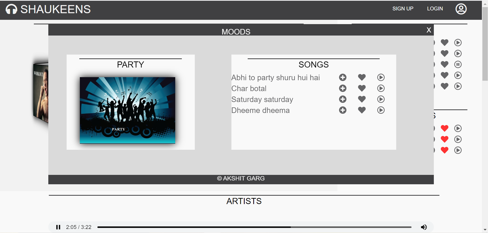
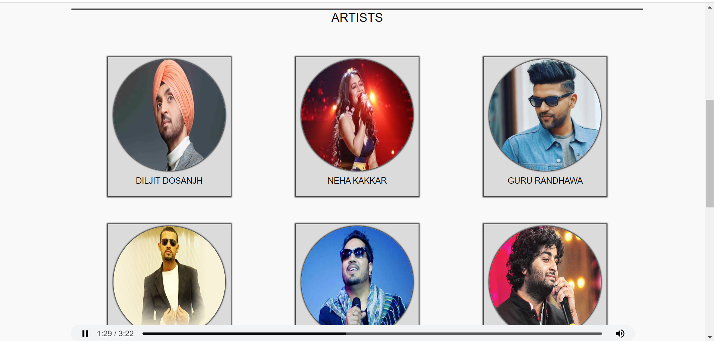
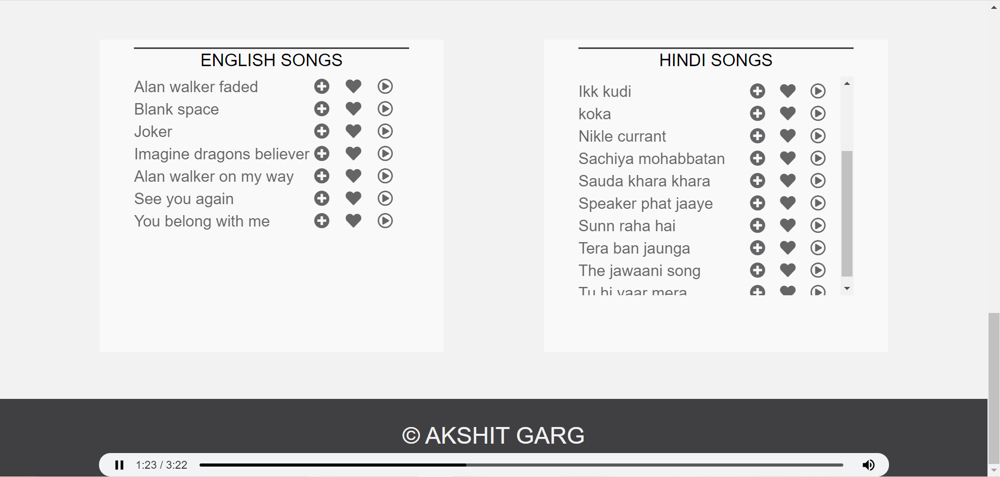

   ##  SHAUKEENS 
SHAUKEENS is a Music Player made with the help of HTML and CSS compatible for both mobile screens and laptops.

## Explore your PlayList and Favourite Songs.

## SignUp or Login To Listen to songs.

## Explore Songs according to your Mood.

## Listen to Songs of your Favourite Singer.

## Listen to Songs of your Favourite Language.

## Add songs to PlayList or Favourite Section.

## Compatible for both Mobile Phones and Laptops
 &nbsp;&nbsp;&nbsp; &nbsp;&nbsp;&nbsp;&nbsp;&nbsp;&nbsp;&nbsp;

# Run Instructions:-
<ul>
   <li>Clone the above repository.</li>
   <li>Install all the dependencies listed in package.json using the following command</li>
          &nbsp;&nbsp; npm install  
   <li>Then use nnpm start to run the server</li>
   <li>Then on any browser type the following url to visit the home page 127.0.0.1:8000</li>
 </ul>
   
You need to Login if you want to maintain your Playlist and Favourites else these lists would be dynamic and they won't reload when you visit again.
